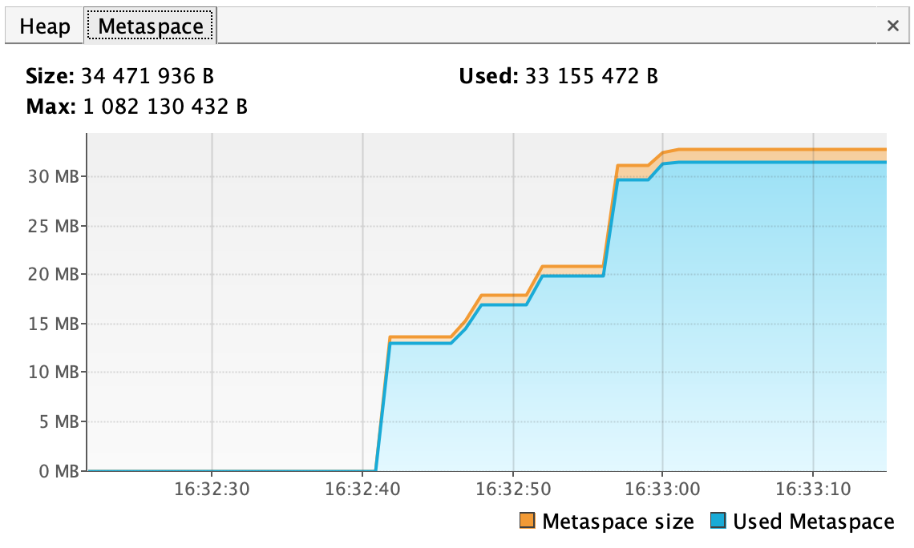
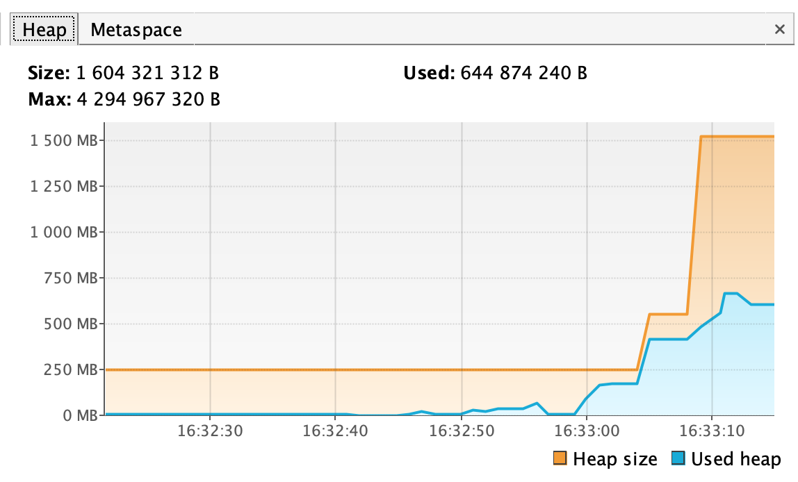

# Задача со звездочкой "Исследование JVM через VisualVM"

```
Please open 'ru.netology.JvmExperience' in VisualVm
// Изначально metaspace был пустой
16:32:45.569108: loading io.vertx
16:32:47.528415: loaded 529 classes
// Резко увеличился до ~13MB после загрузки 529 классов
16:32:50.545143: loading io.netty
16:32:52.500473: loaded 2117 classes
// Более плавно увеличился до ~20MB после загрузки 2117 классов
16:32:55.501180: loading org.springframework
16:32:56.646956: loaded 869 classes
// Вновь резко увеличился до ~30MB после загрузки еще 869 классов
// Как итог можно сделать вывод, что jvm увеличавала metaspace заранее на n MB,
// чтобы не увеличивать ее после каждой подгрузки нового класса
```



```
// heap сильно НЕ увеличивалась при загрузке классов, все помещалось в metaspace
16:32:59.648145: now see heap 
16:32:59.649535: creating 5000000 objects
// после создания 5000000 объектов heap заполнилась ~200MB, 
// при этом JVM увеличила размер heap
16:33:01.095455: created
16:33:04.101281: creating 5000000 objects
// после создания следующих 5000000 объектов heap заполнилась ~400MB, 
// при этом JVM увеличила размер heap до ~600MB
16:33:04.875047: created
16:33:08.048153: creating 5000000 objects
// после создания следующих 5000000 объектов heap заполнилась ~600MB, 
// при этом JVM увеличила размер heap до ~1600MB
16:33:10.820306: created
```




